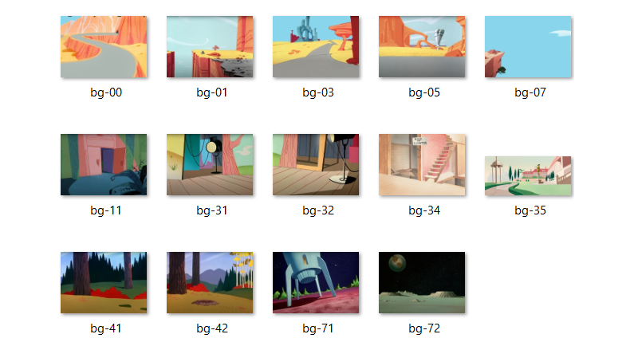

# Warner Bros. Looney Tunes cel background project

## Quick Summary

A collection of general-purpose backgrounds for use with Looney Tunes character animation cels.

## How to use

Browse the collection to find a suitable background for your Looney Tunes animation cel.
Then download and print the image on 11x14 inch photo paper.

## Details

These background artworks were gathered from a wide range of sources. Some of the background art is sourced from digital media, while others are reinstated from poor copies of the original source material. It is important to note that the images available in this collection are not considered "restorations". While the images have undergone color correction and general clean up, the images have then been saturated to "dull" the colors thus allowing the character(s) on the animation cel to be the true hero of your artwork.

All the images have a resolution of 300 DPI, which is considered high-resolution.

No copyright infringement intended. All artwork is the copyright of the original owner (Warner Bros.).
